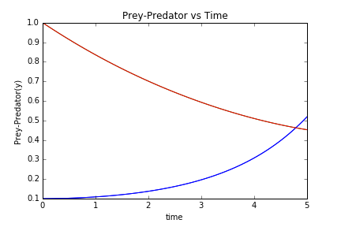
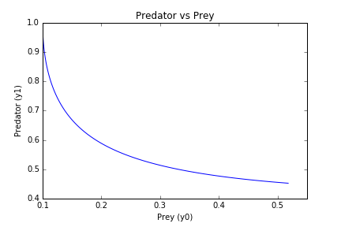
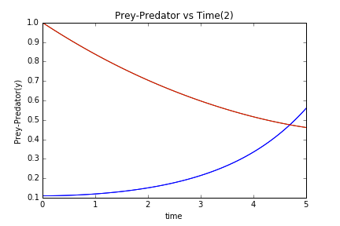
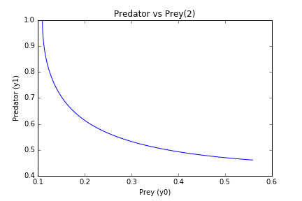

UECM3033 Assignment #3 Report
========================================================

- Prepared by: Ng Wan Ping
- Tutorial Group: T2

--------------------------------------------------------

## Task 1 --  Gauss-Legendre formula

The reports, codes and supporting documents are to be uploaded to Github at: 

[https://github.com/ngwanping/UECM3033_assign3](https://github.com/ngwanping/UECM3033_assign3)

Explain how you implement your `task1.py` here.

First import the numpy and sympy as np and sy respectively.
In the function named gausslegendre,in order to implement the N-point Gauss-Legendre quadrature,use the polynomial.legendre.leggauss to computes the sample points and weights for Gauss-Legendre quadrature. 
As we all known, the default interval for Gauss-Legendre quadrature is [-1,1]. 
To change the interval from [-1, 1] to [a, b], use t =0.5*(x+1)*(b-a)+a .
Then the answer return to gausslegendre function will be the multiplication of the sum of (w*f(t)) and half of the difference of upper and lower limit.

In the main function, the self-defined function named my_integral will return answer for integration.
Lastly, show thw answer of my_integral to compare as the answer returned by gausslegendre.

Explain how you get the weights and nodes used in the Gauss-Legendre quadrature.
The weights and nodes can be obtained by using np.polynomial.legendre.leggauss. 
It will return weights and nodes in the array form. 

---------------------------------------------------------

## Task 2 -- Predator-prey model

Explain how you implement your `task2.py` here, especially how to use `odeint`.

1. First, import numpy, scipy and matplotlib.pyplot as np,sp and plt respectively.
2. Then, construct a self-defined function named dY_dt which will assign the upper limit,b and lower limit,a for the integral and return the differential equations of prey and predator in the form of array. 
3. After that, set the initial condition to y0 and y1 as 0.1 and 1.0 in the array form of Y.
4. By using np.linspace, create 100 intervals between t=0 and t=5.
5. Then use function integrate.odeint in scipy to integrate the system of ordinary differential equations with input dY_dt,array Y and t.
6. The function integrate.odeint  will solve the ODE system using lsoda from the FORTRAN library odepack and solve the initial value problem for stiff or non-stiff systems of first order odes.
7. Furthermore, the graph of y0 and y1 against time is plotted by using the functions in matplotlib.pyplot.
The blue line in the graph represent prey while the red line in the graph represent predator.
The graph is saved as Graph of y1 and y0 against time.png.
8. At the same time, another graph of y1 against y1 is plotted.
The graph is saved as Graph of y1 against y0.png.

In order to test sensitivity,set another initial condition with y0=0.11 and y1=1.0 in the array form as Y2.
Then repeat the steps 4 to 8.The two graphs are saved as Graph of y1 and y0 against time 2.png and Graph of y1 against y0 2.png respectively.

Put your graphs here and explain.

As we can see from both graph, in the beginnning, the population or number of prey (y0) is the lowest while the number of predators (y1) is the highest.
The predators was declined due to no food(prey), so the prey able to increase their population.
As the time increases, the population or number of prey will increases over time as the number of predators is decreasing.
The predators is very little when there are plenty of preys but outstrip their food supply and decline. 
As the predator population is lower then prey population will increase. 
This will continue in a cycle of growth and decline.

Is the system of ODE sensitive to initial condition? Explain.

Since there are only a bit difference between Graph of y1 against y0.png and Graph of y1 against y0 2.png, 
so I think the system of ODE are not so sensitive to initial condition.

-----------------------------------

last modified: 11 April 2016 
